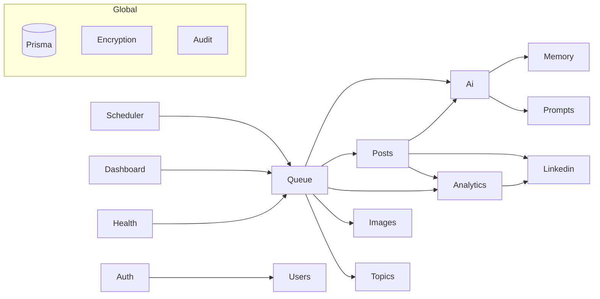

# AI LinkedIn Content Agent — Codebase Map

Monorepo for an AI agent that researches topics, drafts LinkedIn posts, runs an approval workflow, schedules/publishes posts, and collects analytics.

- `backend/` — NestJS 11, Prisma + PostgreSQL, BullMQ + Redis, Swagger at `/api/docs` (non-prod only), Bull Board at `/admin/queues` (Basic-auth). Port **4000**.
- `frontend/` — Next.js 16 App Router (⚠ see `frontend/AGENTS.md`: this Next.js diverges from training data — read `node_modules/next/dist/docs/` before nontrivial changes), React 19, Tailwind v4, shadcn/ui, TanStack Query, NextAuth (credentials → backend JWT). Port **3000**.
- `privacy_policy_automater/` — standalone static HTML privacy page (for the LinkedIn Developer app registration). Not part of the build.

## Running locally

```bash
docker compose up -d postgres redis   # required before backend starts (ECONNREFUSED 5432/6379 otherwise)
cd backend && npm run start:dev       # Node 24 (nvm), NOT the shell-default Node 14
cd frontend && npm run dev
```

Prisma: `npx prisma migrate dev` / `generate` from `backend/`.

## Backend module graph



`DatabaseModule` (PrismaService), `EncryptionModule`, `AuditModule` are `@Global()` — injectable everywhere without import. All modules live in `backend/src/modules/<name>/` with `presentation/` (controllers), `application/` (services), sometimes `domain/` + `infrastructure/`.

## Backend modules (routes prefixed `api/...` per-controller; no global prefix)

| Module | Routes | Key services / notes |
|---|---|---|
| **auth** | `POST api/auth/signup`, `signin` (no guard, CSRF-exempt) | `auth.service.ts`: bcrypt(12), `jsonwebtoken` 7-day JWT `{userId,email}`. No Passport — custom `JwtAuthGuard` in `src/common/guards/jwt-auth.guard.ts` + `@CurrentUser()` decorator. |
| **users** | `GET api/users/me`, `PATCH me/preferences` | Exports `UsersService`. |
| **ai** | `POST api/ai/research`, `generate-post` | `infrastructure/openrouter.client.ts` → OpenRouter chat completions + `generateImage()` (modalities, `OPENROUTER_IMAGE_MODEL`); **throws if `OPENROUTER_API_KEY` unset** unless `AI_MOCK=true` (canned output, loudly logged). `ResearchService` does live research via OpenRouter web-search plugin, returns parsed JSON topics. `WriterService` (template + memory → post), `EditorService.polish` (temp 0.3), `ImagePromptService`. |
| **linkedin** | `GET api/linkedin/oauth/url`, `oauth/callback` (no guard), `status`, `DELETE disconnect` | `linkedin-oauth.service.ts`: state stored as sha256 in `OAuthState` (10 min), token exchange, `/v2/userinfo` profile, org sync; `getValidAccessToken` decrypts + auto-refreshes (<60s to expiry). `linkedin-publisher.service.ts`: `POST /v2/ugcPosts`, URN from `x-restli-id` header, 401→revoked / 403→permission-error handling. |
| **posts** | CRUD: `GET api/posts` (list), `GET :id`, `POST /` (manual create, status DRAFT), `PATCH :id`, `DELETE :id`. Plus `POST drafts` (AI generate), `POST import-linkedin` (backfill history), and transitions `:id/approve\|reject\|publish\|schedule` | `posts.service.ts`: `generateDraft` runs Writer → Editor → Post row (`PENDING_APPROVAL`) → optional GeneratedImage; `create` publishes straight to LinkedIn (calls `publishTextPost` first, then stores the row as PUBLISHED with `linkedinPostUrn` — atomic: if publishing fails nothing is saved); `update` blocks editing PUBLISHED posts and resets APPROVED/SCHEDULED/REJECTED → PENDING_APPROVAL on content change; `remove` deletes the post on LinkedIn first (`DELETE /v2/ugcPosts/{urn}` via `LinkedinPublisher.deleteMemberPost`, only if it has a `linkedinPostUrn`; 404=already gone) then hard-deletes locally (images/analytics cascade) — if the LinkedIn delete fails, the local row is kept; `importFromLinkedIn` pulls member posts via `LinkedinPublisher.fetchMemberPosts` (`GET /v2/ugcPosts?q=authors`) and stores new ones as PUBLISHED rows, deduped by `linkedinPostUrn`. All ops go through `getOwnedPost`/`ensureOwned` (per-user, 404 on cross-user). Publish delegates to LinkedinPublisher. |
| **queue** | `GET api/queue/status` | See queue section below. Exports `QueueService`. |
| **scheduler** | `PATCH api/scheduler` | Two `@Cron(EVERY_MINUTE)` jobs (see below). |
| **analytics** | `GET api/analytics` | `collectFromLinkedIn` GETs `/v2/socialActions/{urn}`; computes ctr/engagementRate into `PostAnalytics`. |
| **dashboard** | `GET api/dashboard` | Overview: recent posts, counts, queue status. |
| **memory** | `POST api/memory` | `AgentMemory` upserts; `getWritingMemory` top-20 by weight (fed into Writer prompts). |
| **prompts** | `GET/POST api/prompts` | `PromptTemplateService`: user default → global default → hardcoded fallback. |
| **topics** | — (no controller) | `saveMany` persists research topics. |
| **images** | — (no controller) | Real generation via `OpenRouterClient.generateImage` (base64 data URL stored on `GeneratedImage.imageUrl`, status PENDING→COMPLETED/FAILED). Drafts fire-and-forget generation; queue worker awaits it. ImagesModule imports AiModule. |
| **jobs** | — | `JobsService` records a `Job` row for every enqueue (called by `QueueService`) and worker events update status (RUNNING/COMPLETED/RETRYING/FAILED by `queueJobId`). |
| **health** | `GET /health`, `/readiness`, `/liveness` (no prefix, no guard) | Checks DB, Redis, queues, provider config. |

### Bootstrap (`backend/src/main.ts`)
Helmet (CSP off in dev), cookie-parser, custom `CsrfMiddleware` (HMAC double-submit cookie `csrf_token`, header `X-CSRF-Token`; exempts health, signin/signup, oauth/callback), global `ValidationPipe({whitelist, transform, forbidNonWhitelisted})`, `HttpExceptionFilter` (logs only stack/status — never the raw Axios error, which carries the bearer token), CORS locked to `FRONTEND_URL` with credentials, nestjs-pino logger. `ThrottlerGuard` registered globally as `APP_GUARD` (100 req/60s; auth controller tightened to 10/60s). Bull Board `/admin/queues` is behind HTTP Basic auth (`BULL_BOARD_USER`/`BULL_BOARD_PASSWORD`) and disabled entirely in production if those are unset.

### Queues (BullMQ, `backend/src/modules/queue/`)
Queues: `ResearchQueue`, `GeneratePostQueue`, `GenerateImageQueue`, `PublishQueue` (concurrency 1), `AnalyticsQueue`, `RetryQueue` (dead-letter for exhausted jobs). Defaults: 3 attempts, exp backoff 30s. Processors in `queue-worker.service.ts`:
- research → `ResearchService` → `TopicsService.saveMany`
- generatePost → pick topic → `PostsService.generateDraft`
- publish → `PostsService.publish` → enqueue analytics
- analytics → `AnalyticsService.collectFromLinkedIn`

Every `enqueue*` records a `Job` row **before** calling `queue.add`, using a `randomUUID()` as the BullMQ `jobId` (worker status updates key off it — a bare per-queue `job.id` collides across queues). `enqueueRetry` is the only untracked path.

`SchedulerService` (`@Cron` every minute): `enqueueDueUsers` (per-user `nextScheduledRunAt`, recomputed with luxon + cron-parser for DAILY/WEEKLY/…/CUSTOM_CRON) and `enqueueDueScheduledPosts` (atomically claims SCHEDULED→APPROVED via `updateMany`, then enqueues publish).

### Prisma models (`backend/prisma/schema.prisma`)
`User` (1–1 `LinkedInAccount`; 1–many Post/PromptTemplate/Topic/AgentMemory/Job/OAuthState/AuditLog; schedule fields live on User) · `LinkedInAccount` (tokens stored **encrypted**: `accessTokenCiphertext`/`refreshTokenCiphertext` + `tokenKeyVersion`; 1–many `LinkedInOrganization`) · `OAuthState` · `Topic` · `PromptTemplate` · `Post` (status enum: DRAFT→PENDING_APPROVAL→APPROVED/REJECTED→SCHEDULED→PUBLISHED/FAILED; `linkedinPostUrn`) · `GeneratedImage` · `PostAnalytics` (1–1 Post) · `AgentMemory` (unique userId+type+key) · `Job` · `AuditLog`.

Token encryption: `src/common/encryption/encryption.service.ts` — AES-256-GCM, versioned keys (`TOKEN_ENCRYPTION_KEY[_VERSION]`, `TOKEN_ENCRYPTION_PREVIOUS_KEYS` for rotation).

### Env vars (`backend/.env.example`; validated in `src/config/env.validation.ts`)
Required: `DATABASE_URL`, `REDIS_URL`, `JWT_SECRET`, `TOKEN_ENCRYPTION_KEY`, `CSRF_SECRET`. Others: `PORT`, `FRONTEND_URL`, `OPENROUTER_API_KEY/BASE_URL/MODEL`, `LINKEDIN_CLIENT_ID/SECRET/REDIRECT_URI`, `LINKEDIN_SCOPES` (default `openid profile w_member_social`), `LOG_LEVEL`, `NODE_ENV`.

## Frontend (`frontend/src/`)

Routes (App Router, `src/app/`): `/` (login/signup, public) · `/dashboard` · `/posts` (AI generate + full manual CRUD) · `/approval` (approve/reject/publish/schedule) · `/analytics` · `/settings` (LinkedIn connect/disconnect) · `/api/auth/[...nextauth]`.

The `/posts` page ([app/posts/page.tsx](frontend/src/app/posts/page.tsx)) wires create/read/update/delete via React Query mutations to the posts API; the create/edit form is [components/posts/post-editor-dialog.tsx](frontend/src/components/posts/post-editor-dialog.tsx) (remounted per-open with a `key` so fields seed from `useState` initializers — no setState-in-effect). Per-row actions use a base-ui `DropdownMenu` (note: `DropdownMenuTrigger` takes a `render={<Button/>}` prop, **not** `asChild`). Delete confirms via `window.confirm`.

- **Auth**: NextAuth credentials provider in `src/auth.ts` — `authorize()` POSTs to backend `/auth/signin`; backend `accessToken` rides inside the NextAuth JWT session (augmented in `src/types/next-auth.d.ts`). Server-side guard in `src/proxy.ts` (Next 16 renamed middleware → proxy): `getToken` + redirect to `/` with `callbackUrl` for /dashboard, /posts, /approval, /analytics, /settings. `NEXTAUTH_SECRET` lives in `frontend/.env.local` (gitignored) and must be set in prod. Client-side guard in `components/layout/app-shell.tsx` remains as a second layer; protected pages still wrap in `<AppShell>`.
- **API client**: `src/lib/api/client.ts` — `apiRequest<T>(path)`, base `NEXT_PUBLIC_API_URL` (fallback `http://localhost:4000/api` — duplicated in `src/auth.ts` and `src/app/page.tsx`), attaches `Authorization: Bearer` from `getSession()` and `X-CSRF-Token` from the `csrf_token` cookie on mutations. All data fetching goes through React Query (`components/providers/app-providers.tsx`).
- **UI**: shadcn primitives in `components/ui/`, dashboard widgets in `components/dashboard/`, types in `src/lib/api/types.ts`.

## Gotchas / known gaps
- Shell-default Node is 14 (breaks prisma/nest); use nvm Node 24.
- Backend AI calls throw unless `OPENROUTER_API_KEY` is set or `AI_MOCK=true` (currently true in local `.env`; set a real key for live output). Image model: `OPENROUTER_IMAGE_MODEL`.
- Generated images are stored as base64 data URLs in `GeneratedImage.imageUrl` — no object storage yet, and publishing to LinkedIn is still text-only (no image asset upload).
- LinkedIn scopes limited to approved set (`w_member_social`); analytics collection via `socialActions` may be permission-limited.
- **Importing a member's past posts** (`POST api/posts/import-linkedin`) requires the LinkedIn token to carry the **`r_member_social`** read scope. The default `LINKEDIN_SCOPES` is intentionally NOT changed (adding an unapproved scope breaks the OAuth authorize flow). Until the LinkedIn app is approved for read access, `LINKEDIN_SCOPES` includes `r_member_social`, and the user reconnects, import returns a 403 permission error (or 412 if LinkedIn isn't connected at all). The code path is complete and gated only on that permission.
- New protected frontend routes must be added to the matcher in `src/proxy.ts` AND wrap in `<AppShell>`.
- New backend controllers must hardcode the `api/` prefix and add `@UseGuards(JwtAuthGuard)` themselves; mutations from the frontend need the CSRF cookie flow unless exempted in `main.ts`.
